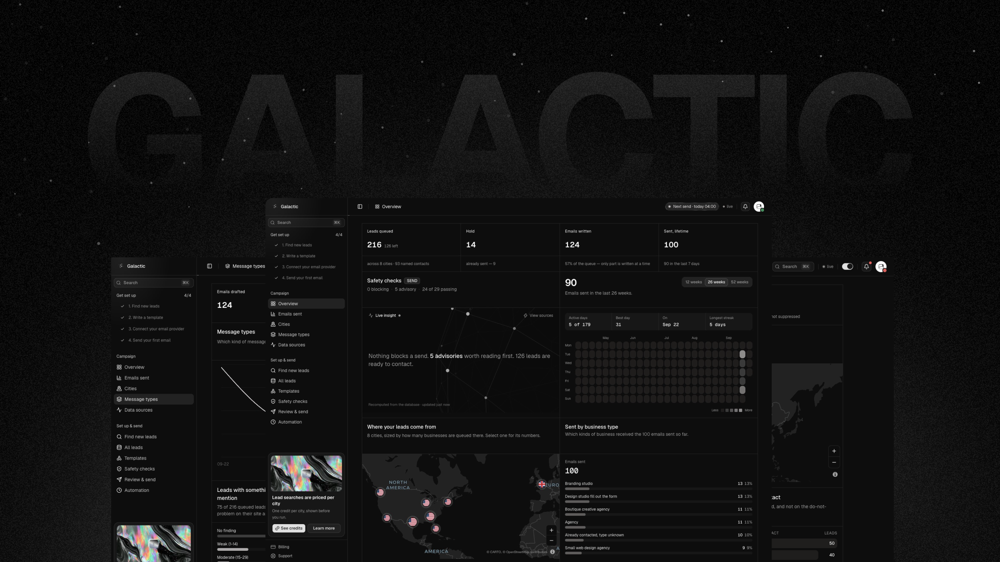

  

<h1 align="center">
  Galactic Outreach
</h1>

<h4 align="center">
  <a href="https://galacticoutreach.com/docs/home">Documentation</a> |
  <a href="https://galacticoutreach.com">Website</a>
</h4>

  The workflow around your outbound email

  
  

  
  

## Getting Started

The fastest way to get started is with [Galactic Outreach](https://galacticoutreach.com/login). It is a hosted environment with the pipeline, the sender and the compliance checks already wired together — no infrastructure to stand up. [Start free, no card needed](https://galacticoutreach.com/pricing)

To understand what a campaign actually does before you run one, visit the [Documentation](https://galacticoutreach.com/docs/home).

## About Galactic Outreach

Galactic Outreach is cold email software: it finds businesses by industry and city, writes to each one, and sends through your own email provider, checking every email before it leaves.

The checks are the point. Up to twenty-nine of them run before anything leaves — postal address, unsubscribe link, leftover placeholders, people you've already emailed, SPF and DMARC on your sending domain — and a blocking one stops the send. [Every check is listed](https://galacticoutreach.com/docs/sending#verdict), with which ones block. Everyone contacted gets logged, so nobody gets the same email twice, and anyone who unsubscribes or bounces is off the list for good.

The rules follow the recipient. Leads in countries that require opt-in before a first email or forbid mail to addresses collected from the web — Germany, Spain, Poland, the Netherlands and Singapore — are held and never sent to, and no setting overrides that. [Country rules](https://galacticoutreach.com/docs/choosing-who-to-email#how) lists the rule applied to every city, with the law behind it.

It sends through your own account, not ours: Resend, Amazon SES, Mailgun or SendGrid, or your own Microsoft 365 or Google Workspace mailbox, capped at 50 emails a day. Your sending reputation stays yours, and it leaves with you. Every provider sets its own rules on what you may send, to protect its reputation and your domain: read them before you connect one. Resend's forbids cold outreach by name. [What each policy says](https://galacticoutreach.com/docs/email-providers#policies).

## Updates & Integrations

Follow the [Changelog](https://galacticoutreach.com/changelog) to keep up with what has shipped.

Check out all [available email providers](https://galacticoutreach.com/docs/email-providers) and what each one needs.

## Support & Feedback

The Support screen inside the dashboard is where questions, feedback and bug reports go. A filed message can be followed: it shows what you wrote and a dated trail of what has happened to it since, and the reply comes by email.

Galactic Outreach is proprietary and its source is private, but contributions are welcome: bug reports, ideas and documentation corrections, as a [GitHub issue](https://github.com/galacticoutreach/Galactic/issues/new/choose) or from the Support screen. [How to contribute](./CONTRIBUTING.md) says what makes a report useful, and what contributing to a proprietary product means. Security issues go to [SECURITY.md](./SECURITY.md), never a public issue.

## Other channels

- [Documentation](https://galacticoutreach.com/docs/home)
- [Country rules](https://galacticoutreach.com/docs/choosing-who-to-email#how)
- [Pricing](https://galacticoutreach.com/pricing)
- [Compared with Apollo.io, ZoomInfo, Hunter and Clay](https://galacticoutreach.com/docs/compare)
- [Changelog](https://galacticoutreach.com/changelog)
- [Who builds this](https://galacticoutreach.com/author)
- [hello@galacticoutreach.com](mailto:hello@galacticoutreach.com)

## License

Proprietary. Copyright © Galactic Outreach. All rights reserved. This repository is published for reference and carries no licence to use, copy, modify or redistribute any part of the product; the application's source is private. Use of the hosted service is governed by the [Terms](https://galacticoutreach.com/terms), the [Privacy Policy](https://galacticoutreach.com/privacy) and the [Refund Policy](https://galacticoutreach.com/refunds).
